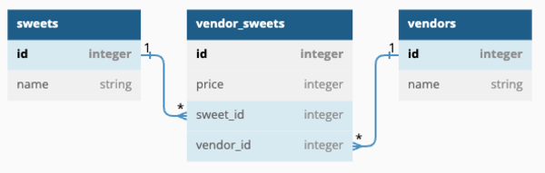

# Phase-4-Code-Challenge-VendorSweets

This repository contains a Flask application and a React frontend application tailored to handle vendors and sweets data within the domain.

## Features

- Flask application with core features implemented.
- Fully built React frontend application.
- Inclusive test suite that can be run using `pytest -x`.

## Usage

You have several options to interact with the API based on your preference:

1. Utilize Postman to make requests.
2. Run `pytest -x` to verify if your code passes the tests.
3. Interact with the API via the React application running in the browser.

## Setup

Ensure you navigate into the `code-challenge` folder **before** opening the code editor.

To install dependencies for both the frontend and backend, execute the following commands:

```bash
    pipenv install
    pipenv shell
    npm install --prefix client
```

## Running the Flask API

Navigate to [localhost:5555](http://localhost:5555) by executing:

```bash
    python server/app.py
```

## Running the React App

Navigate to [`localhost:4000`](http://localhost:4000) using:

```bash
    npm start --prefix client
```

## Models

The API operates based on the following data model:


Separate the model entities into individual scripts as per the instructions provided in the template. You're required to fulfill the commented instructions for each model class, with necessary imports included.

To initialize the database app.db, execute the following commands:

```bash
    export FLASK_APP=server/app.py
    flask db init
    flask db upgrade head
```

Establish the model relationships as shown in the ER Diagram. Ensure that a VendorSweet model cascades deletes. Set serialization rules to limit recursion depth. Run migrations and seed the database:

```bash
flask db revision --autogenerate -m 'message'
flask db upgrade head
python server/seed.py
```

If the provided seed file doesn't work, you're welcome to generate your own seed data.

## Validations

The VendorSweet model includes the following validations:

- price must have a value (i.e., can't be None).
- price cannot be a negative number.

## Routes

The following routes are configured to return JSON data along with the appropriate HTTP verbs.

### GET /vendors

Returns JSON data listing all vendors:

```json
[
  { "id": 1, "name": "Insomnia Cookies" },
  { "id": 2, "name": "Cookies Cream" }
]
```

### GET /vendors/:id

Returns JSON data for a specific vendor, including associated sweets if the vendor exists:

```json
{
  "id": 1,
  "name": "Insomnia Cookies",
  "vendor_sweets": [
    {
      "id": 2,
      "price": 45,
      "sweet": {
        "id": 2,
        "name": "Chocolate Chunk Cookie"
      },
      "sweet_id": 2,
      "vendor_id": 1
    }
  ]
}
```

If the vendor doesn't exist, returns:

```json
{
  "error": "Vendor not found"
}
```

### GET /sweets

Returns JSON data listing all sweets:

```json
[
  { "id": 1, "name": "Chocolate Chip Cookie" },
  { "id": 2, "name": "Brownie" }
]
```

### GET /sweets/:id

Returns JSON data for a specific sweet:

```json
{
  "id": 1,
  "name": "Chocolate Chip Cookie"
}
```

If the sweet doesn't exist, returns:

```json
{
  "error": "Sweet not found"
}
```

### POST /vendor_sweets

Creates a new VendorSweet associated with an existing vendor and sweet. Accepts an object with the following properties in the request body:

```json
{
  "price": 300,
  "vendor_id": 1,
  "sweet_id": 3
}
```

If the VendorSweet is created successfully, responds with:

```json
{
  "id": 7,
  "price": 300,
  "sweet": {
    "id": 3,
    "name": "M&Ms Cookie"
  },
  "sweet_id": 3,
  "vendor": {
    "id": 1,
    "name": "Insomnia Cookies"
  },
  "vendor_id": 1
}
```

If the VendorSweet is not created successfully, returns:

```json
{ "errors": ["validation errors"] }
```

### DELETE /vendor_sweets/:id

Deletes an existing VendorSweet. If the VendorSweet exists and is deleted successfully, responds with an empty object.

```json
{}
```

If the VendorSweet doesn't exist, returns:

```json
{
  "error": "VendorSweet not found"
}
```

## Author

Brian James Mariga

## License

This project is licensed under the MIT License.
